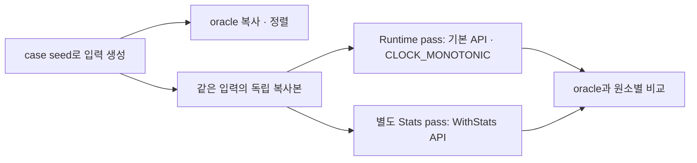
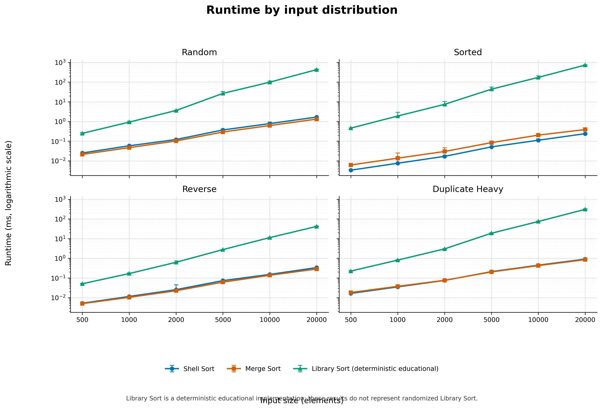
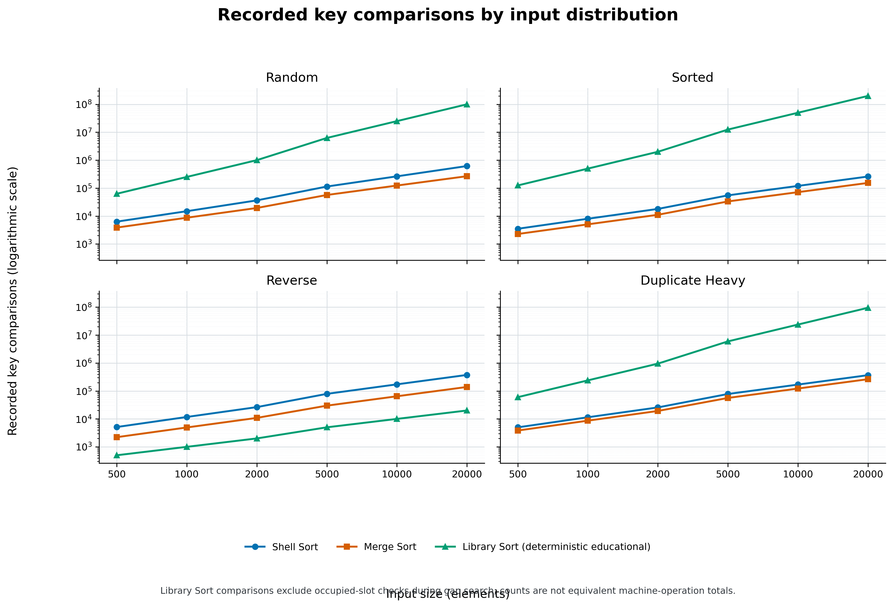
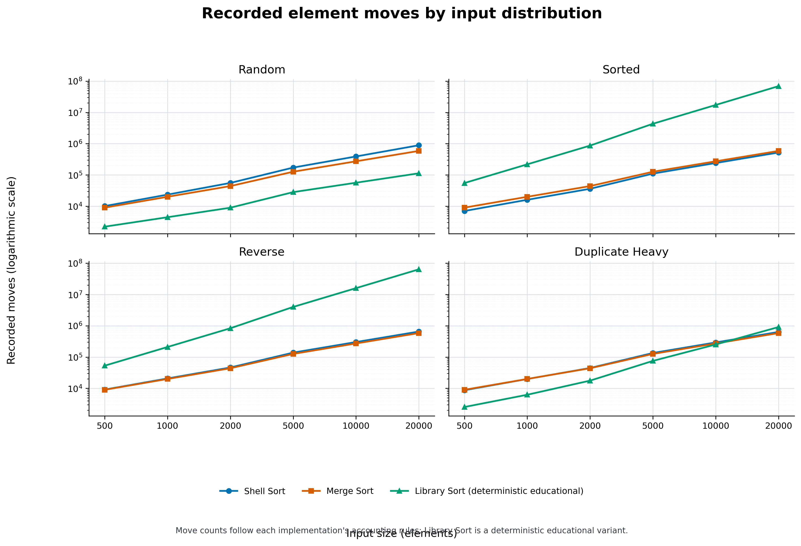
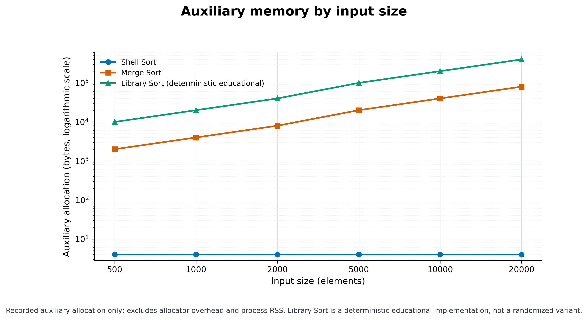

## — Shell Sort, Merge Sort, Library Sort를 중심으로

세 정렬의 구현을 같은 함수 호출 규약으로 실행하고, 같은 입력에서 시간·연산 통계·보조 메모리를 비교했다.

- 구현: [`shell_sort.c`](shell_sort.c) · [`merge_sort.c`](merge_sort.c) · [`library_sort.c`](library_sort.c)
- 실행: `make test` (C 53 checks · Python 7 tests) · `make benchmark-final`
- 환경: C17 · `-O2 -Wall -Wextra` · 컨테이너
- 실험: 6개 입력 크기 · 4개 분포 · 조합별 30 trials · master seed `20260930`

---

## 차례

1. [코드 보고서](#1-코드-보고서) — 무엇을 어떻게 만들었나
2. [알고리즘 상세](#2-알고리즘-상세) — 세 정렬이 실제로 어떻게 도나
3. [알고리즘 실험](#3-알고리즘-실험) — 같은 잣대로 재고 견준 결과

---

## 1. 코드 보고서

설계에서 무엇을 나누었고, 그 선택이 공정한 비교와 검증에 어떤 도움을 주는지 설명한다.

### 1.1 설계 및 측정 구조

세 기본 함수는 같은 형태다. 그래서 runtime benchmark는 정렬 이름을 `void(int[], int)` 함수 포인터 배열에 등록하고 같은 호출 경로로 실행한다.

```c
/* report/benchmark.c */
typedef void (*SortFunction)(int[], int);

static SortFunction runtimeSorts[ALGORITHM_COUNT] = {
	shellSort, mergeSort, librarySort
};
```

이것은 sample report의 범용 `SortAlgorithm` 구조체와는 다른 단순한 함수 포인터 배열이다. 이 프로젝트는 `void *` 원소, 비교 함수 포인터, 알고리즘 메타데이터를 묶은 공통 객체를 구현하지 않았다.

| 목적 | 실제 API | 이유 |
|---|---|---|
| Runtime | `shellSort`, `mergeSort`, `librarySort` | 모두 `void(int[], int)`라 동일한 함수 포인터 타입으로 호출 가능. counter 갱신 없이 실제 정렬 호출을 측정한다 |
| Stats | `shellSortWithStats`, `mergeSortWithStats`, `librarySortWithStats` | 실행시간과 분리해 구현별 비교·이동·할당량을 기록한다 |
| 결과 확인 | `qsort` oracle과 원소별 비교 | `qsort`는 oracle 생성에만 쓰고 정렬 구현 내부에서는 사용하지 않는다 |

세 알고리즘은 [`sort_stats.h`](sort_stats.h)의 `SortStats`에 `comparisons`, `moves`, `auxiliary_bytes`를 기록한다. Shell의 stats API는 `void`이고 Merge/Library의 stats API는 성공 여부를 `int`로 반환한다. Runtime 호출은 계측 없는 기본 API를 선택하고 Stats run은 동일한 case seed로 입력을 다시 생성해 통계 API를 부른다. counter 증가가 runtime에 끼치는 영향을 피하면서 실제 구현이 요청한 동적 할당과 해제는 정렬 호출의 일부로 측정할 수 있다.



Final run에서는 여섯 실행 permutation을 고르게 사용했다. `trial % 6`으로 순서를 고르므로 30회에서 각 permutation이 조건마다 5회씩 쓰이고, 각 알고리즘은 first/second/third 위치에 각각 10회씩 배치된다. 이 균형은 실행 순서에 따른 cache·system load 편향을 줄이기 위한 것이지 환경 변동을 완전히 제거하지는 않는다.

### 1.2 파일 구조

| 파일 | 맡은 것 |
|---|---|
| [`shell_sort.c`](shell_sort.c) · [`shell_sort.h`](shell_sort.h) | Shell Sort 구현과 기본/Stats API |
| [`merge_sort.c`](merge_sort.c) · [`merge_sort.h`](merge_sort.h) | bottom-up Merge Sort와 기본/Stats API |
| [`library_sort.c`](library_sort.c) · [`library_sort.h`](library_sort.h) | sparse-slot 교육용 Library Sort와 기본/Stats API |
| [`sort_stats.h`](sort_stats.h) | 공통 `SortStats` 필드 정의 |
| [`tests/test_sort.c`](tests/test_sort.c) | 네 정렬의 C 테스트, 극단값과 고정 seed 난수 검사 |
| [`../tests/test_sort.c`](../tests/test_sort.c) · [`../tests/test_sort.py`](../tests/test_sort.py) | root의 C forwarding include와 기존 Python Bubble Sort 테스트 |
| [`benchmark.c`](benchmark.c) | pilot/final 입력 생성, runtime·Stats pass, CSV 출력 |
| [`../Makefile`](../Makefile) | root에서 테스트 및 `benchmark-pilot`/`benchmark-final` 실행 |
| [`results/`](results/) | pilot/final raw CSV와 그룹별 summary CSV |
| [`plot_results.py`](plot_results.py) · [`figures/`](figures/) | summary에서 PNG/PDF Figure 생성 및 결과 보관 |

테스트와 benchmark의 C 진입점은 `report/`에 있지만, 저장소의 기존 실행 인터페이스를 유지하기 위해 Makefile은 root에 남아 report 파일을 빌드한다.

### 1.3 검증

[`report/tests/test_sort.c`](tests/test_sort.c)의 `expectAllSorted`는 동일 입력 복사본을 Bubble·Shell·Merge·Library Sort에 전달한다. 섞인 배열, 이미 정렬, 역순, 중복, 모두 같은 값, 음수와 0, `INT_MIN`/`INT_MAX`, 원소 하나, 빈 배열을 검사한다. 별도 검사에서 Stats 값과 잘못된 Library 입력도 확인하고, 고정 seed 난수를 11개 크기(`0`부터 `256`)로 만들어 Library Sort 결과를 oracle과 비교한다.

`make test` 결과는 C **53 checks, 0 failures**, Python **7 tests 통과**다. Python 테스트는 기존 `bubble_sort`의 동작과 제자리 정렬을 검사하며 새 C 알고리즘의 correctness 증거와 구분한다. 전체 C 테스트는 ASan/UBSan으로 통과했고, CFLAGS `-Wall -Wextra` 빌드에서 경고가 없었다. 추가 `-Werror` 구문 검사는 Library Sort 파일에 수행했다. `git diff --check`도 통과했다. `int[]` 인터페이스에서는 동일한 정수들의 개별 정체성을 구별할 수 없어 안정성을 실측하는 테스트는 없다.

---

## 2. 알고리즘 상세

세 구현을 교과서 정의만으로 설명하지 않고 실제 loop와 자료구조를 따라간다.

### 2.1 Shell Sort

`gap`은 `n / 2`에서 시작해 매 반복마다 정수 나눗셈으로 절반이 된다. 각 gap에서 `index`를 왼쪽부터 훑으며 현재 값을 임시 변수 `value`에 저장하고, gap만큼 왼쪽의 값이 더 크면 오른쪽으로 이동시킨 뒤 빈 자리에 `value`를 기록한다.

```c
for (int gap = n / 2; gap > 0; gap /= 2) {
	for (int index = gap; index < n; index++) {
		int value = a[index];
		/* gap 삽입: 큰 값을 gap만큼 오른쪽으로 이동 */
	}
}
```

별도 배열을 만들지 않으며 임시 정수 한 개만 사용한다($O(1)$ auxiliary space). gap sequence는 먼 거리의 역전을 먼저 줄여 일반 삽입 정렬보다 원소 이동을 줄일 수 있다. 이 halving-gap 구현의 보수적 worst-case는 $O(n^2)$이고, 안정 정렬은 아니다. 비교가 같은 값에 멈추더라도 여러 gap pass에서 같은 값의 상대 순서가 보존된다는 보장은 없다.

### 2.2 Merge Sort

이 구현은 재귀가 아니라 **bottom-up** 방식이다. 폭 1인 run부터 시작해 이웃한 두 run을 scratch buffer로 병합하고 폭을 두 배로 늘린다. 마지막에 짝이 없는 run은 그대로 다음 pass로 넘긴다.

```c
if (a[first] <= a[second]) {
	buffer[output++] = a[first++];
} else {
	buffer[output++] = a[second++];
}
```

값이 같을 때 왼쪽 run의 원소를 먼저 가져오므로 병합 단계에서 상대 순서를 보존한다. 추가 buffer는 `n * sizeof(int)`이고 시간 복잡도는 입력 분포에 관계없이 $O(n \log n)$, 보조 공간은 $O(n)$이다. 기본 API는 allocation 실패 시 Shell Sort로 fallback하지만 Stats API는 실패를 반환한다. 관측된 run에서는 Stats pass가 전부 성공했다.

### 2.3 Library Sort

이번 구현은 정통 randomized Library Sort를 구현한 것이 아니라 gap과 rebalance를 보여 주는 **deterministic educational implementation**이다.

```c
typedef struct {
	int value;
	bool occupied;
} LibrarySlot;
```

빈 slot은 sentinel 값이 아니라 `occupied`로 구분하므로 음수, 0, `INT_MIN`, `INT_MAX`를 값으로 사용할 수 있다. capacity는 이 구현에서 `2*n`으로 정했다. 이 값은 Library Sort 일반의 필수 조건은 아니다.

삽입은 다음 순서로 진행한다.

1. sparse array 자체를 선형 탐색해 처음으로 `slot.value >= value`인 점유 slot을 삽입 경계로 찾는다. 같은 거리의 빈 slot은 오른쪽부터 검사하는 deterministic tie-break를 사용한다.
2. 경계에서 좌우로 거리를 늘려 nearest empty slot을 찾는다.
3. 오른쪽 빈 칸이면 그 칸부터 역방향으로 복사하고, 왼쪽 빈 칸이면 경계 쪽으로 왼쪽 이동해 삽입 공간을 연다.
4. batch를 `1, 2, 4, 8, ...`로 늘린다. batch 삽입 후 아직 입력이 남아 있으면 점유 원소를 왼쪽부터 scratch에 모으고 기존 순서를 유지한 채 gap을 다시 분배한다.

`rebalanceSlots`는 현재 점유 원소를 scratch에 복사한 뒤 `emptyCount / (count + 1)`을 기본 gap으로 삼아 배열의 앞·뒤·원소 사이에 빈 공간을 분산한다. 배열 `a`에는 모든 내부 작업이 끝난 뒤 결과를 복사한다. 용량 `2*n`의 slot 배열과 `n`개 scratch를 사용하므로 보조 공간은 $O(n)$이다. 선형 경계 탐색과 이동이 누적될 수 있어 보수적 worst-case 시간은 $O(n^2)$이며 randomized Library Sort의 expected $O(n \log n)$을 보장하지 않는다.

새 중복값은 첫 번째 동일값 앞에 삽입된다. 정수 값만 쓰는 현재 interface로는 안정성을 직접 실측할 수 없고, 동률 원소의 순서도 보장하지 않으므로 안정 정렬이라고 주장하지 않는다.

---

## 3. 알고리즘 실험

같은 입력을 사용한 최종 30-trial 데이터와 기존 Figure를 바탕으로 관찰하고, 각 패턴을 실제 구현과 연결한다.

### 3.1 실험 개요

| 조건 | 설정 |
|---|---|
| 입력 크기 | 500, 1,000, 2,000, 5,000, 10,000, 20,000 |
| 분포 | random, sorted, reverse, duplicate-heavy |
| 반복 | 각 `(size, distribution, algorithm)` 조합당 30 trials |
| PRNG | 고정 master seed `20260930`; size·분포·trial에서 case seed 파생 |
| Runtime timer | `clock_gettime(CLOCK_MONOTONIC, ...)` |
| 실행 순서 | SML, SLM, MSL, MLS, LSM, LMS를 조건별 각 5회 |

`random`은 -1,000,000부터 1,000,000, `duplicate-heavy`는 -10부터 10 범위에서 생성한다. `sorted`는 `index * 3 + offset - count * 3 / 2` 수열(offset 0–2)이고 `reverse`는 그 역순이다. 같은 case seed에서 만든 원본을 세 알고리즘이 각각 복사해 사용한다.

Runtime pass에서는 기본 API를 `SortFunction` 함수 포인터로 호출한다. Timer에는 정렬 호출만 들어가며 입력 생성, oracle 정렬, 복사, correctness 비교, CSV 쓰기는 제외한다. 정렬 함수 안의 `malloc`/`calloc`/`free`는 호출 비용이므로 포함한다. Stats pass에서는 같은 case seed를 재생성하고 `WithStats` API를 호출한다. 그 pass의 시간은 성능 분석값으로 사용하지 않는다.

oracle은 `qsort`로 정렬한 복사본이다. `qsort`는 benchmark 정렬 함수 내부가 아닌 정답 생성에만 쓴다. Runtime 결과와 Stats 결과를 각 oracle과 원소별 비교해 `correct`로 기록한다.

| 지표 | 기록 방식 | 해석상 주의 |
|---|---|---|
| Runtime | 호출시간(ns), 30회 median·Q1–Q3 | 정렬 함수 내부 allocation/free 포함 |
| Comparisons | Stats API 카운터 | 구현이 정의한 비교만 세며 전체 CPU 연산량은 아님 |
| Moves | Stats API 카운터 | 각 구현이 기록하는 값 대입·복사 규칙에 따름 |
| Auxiliary memory | Stats API의 요청 allocation bytes | allocator overhead나 process RSS가 아님 |
| Correctness | oracle과 원소별 비교 | runtime 및 Stats CSV 양쪽 기록 |

특히 Library Sort의 `comparisons`는 insertion-boundary의 값 비교를 기록하지만 nearest-gap 탐색 중 `occupied` 확인 횟수는 포함하지 않는다. 따라서 비교 수를 세 알고리즘의 동일한 machine-level work라고 해석할 수 없다. Moves도 구현별 계수 정의가 같지 않다.

### 3.2 실험 결과

#### 입력 크기 20,000에서의 Runtime



Figure 1은 네 분포를 2×2 panel로 분리하고 공통 log y축을 사용한다. 선은 median, error bar는 Q1–Q3이며 x 위치는 입력 크기 순서대로 같은 간격이다. 대표 결과는 다음과 같다.

| 분포 | Shell Sort median ms (Q1–Q3) | Merge Sort median ms (Q1–Q3) | Library Sort median ms (Q1–Q3) |
|---|---:|---:|---:|
| random | 1.681 (1.666–1.743) | 1.322 (1.314–1.347) | 432.218 (418.876–464.143) |
| sorted | 0.241 (0.241–0.251) | 0.391 (0.381–0.407) | 739.906 (696.200–771.984) |
| reverse | 0.337 (0.323–0.345) | 0.285 (0.276–0.292) | 41.803 (41.389–43.930) |
| duplicate-heavy | 0.910 (0.901–0.921) | 0.853 (0.846–0.873) | 308.167 (288.608–330.893) |

Shell Sort는 sorted에서, Merge Sort는 reverse에서 이 세부 비교 중 가장 낮은 median을 보였다. 두 알고리즘의 값은 밀리초 수준인 반면 Library Sort는 분포에 따라 수십~수백 밀리초다. Library Sort의 sorted가 특히 느린 이유는 새 값이 계속 뒤쪽 경계를 찾는 선형 탐색과 매 라운드 재배치가 누적되기 때문이다. Reverse에서는 경계 값 비교는 적지만 gap을 만들기 위한 shift가 커지는 다른 비용 양상이 보인다.

#### Comparisons



Figure 2에서 Library Sort의 sorted 입력 comparisons median은 199,990,000이고 reverse는 19,999다. sorted 값은 선형 경계 탐색이 점유 원소를 계속 훑는 현재 구현과 일치한다. Reverse에서는 매 삽입의 첫 경계 값에서 멈출 수 있어 기록한 값 비교가 작다. 다만 gap 탐색의 `occupied` 검사는 이 카운터에서 빠져 있으므로 이 그래프만으로 알고리즘 전체 연산량을 비교하지 않는다.

#### Moves



Figure 3에서 Library Sort sorted의 moves median은 69,069,604, reverse는 64,056,467인 반면 random은 112,682.5다. Reverse는 comparisons가 매우 적어도 shift가 클 수 있고, sorted는 값 비교와 재배치·복사 모두 커질 수 있다. 입력 분포에 따라 같은 알고리즘의 병목이 다르게 나타난다는 점을 보여 준다.

#### Auxiliary Memory



Figure 4의 `n=20,000` 값은 Shell Sort 4 bytes, Merge Sort 80,000 bytes, Library Sort 400,000 bytes다. Shell은 임시 정수 하나, Merge는 `n`개 int scratch, Library는 `2*n` slot과 `n`개 scratch allocation을 기록한다. 이는 구현이 요청한 auxiliary allocation이며 allocator overhead 또는 process RSS가 아니다.

#### 입력 크기 변화

아래 비율은 `n=20,000` median을 `n=500` median으로 나눈 **observed empirical scaling**이다. 이 두 점의 비율은 이론적 Big-O 추정이 아니다.

| 알고리즘 | random | sorted | reverse | duplicate-heavy |
|---|---:|---:|---:|---:|
| Shell Sort | 66.891x | 71.802x | 64.958x | 55.444x |
| Merge Sort | 62.066x | 63.214x | 57.255x | 46.820x |
| Library Sort | 1733.411x | 1606.344x | 826.149x | 1372.010x |

이 범위에서 Shell/Merge의 관측 비율은 약 47–72배였고 Library Sort는 약 826–1,733배였다. Library Sort의 수치는 해당 deterministic educational implementation의 선형 탐색·shift/rebalance 동작을 반영한다. 이것을 randomized Library Sort 일반의 성능이나 점근 복잡도로 일반화하지 않는다.

### 3.3 한계

- Runtime은 이 컨테이너·compiler 설정과 측정 시점의 system load에 의존한다. 다른 환경의 절대시간을 보장하지 않는다.
- Runtime pass의 Merge Sort 기본 API는 buffer 할당에 실패하면 내부적으로 Shell Sort fallback을 사용한다. Runtime CSV에는 fallback 여부가 별도 기록되지 않는다. Stats pass의 Merge Sort 호출은 상태를 반환하며 관측된 Stats 행은 모두 성공했지만, runtime correctness만으로 fallback 발생 여부를 식별할 수는 없다.
- Shell Sort는 현재 halving-gap sequence, Merge Sort는 bottom-up 구현, Library Sort는 deterministic educational variant 결과다. 이름이 같은 모든 구현을 대표하지 않는다.
- Library Sort comparisons에서 occupied-slot 검사가 빠져 있고, moves 정의도 구현별이다. 두 Stats 지표를 동일한 기계 연산 수로 해석하면 안 된다.
- Auxiliary bytes는 allocator overhead·fragmentation·process RSS를 측정하지 않는다.
- `n=500 → 20,000` 비율은 관측값이지 이론적 complexity 분석이 아니다.
- `int[]` interface로 안정성을 직접 판별할 수 없으며, Library Sort는 안정 정렬을 보장하지 않는다.

Pilot 10 trials는 feasibility 확인에만 사용했고 final 분석과 합산하지 않았다. Final runtime 및 Stats는 각각 2,160 rows, 720 cases이며 모두 correctness를 통과했다. 여섯 permutation은 조건별 각 5회, 알고리즘 위치는 first/second/third 각각 10회 사용됐다. 전체 final run의 wall-clock은 128.192초였다.

---

[`results/runtime.csv`](results/runtime.csv) · [`results/stats.csv`](results/stats.csv) · [`results/runtime_summary.csv`](results/runtime_summary.csv) · [`results/stats_summary.csv`](results/stats_summary.csv)에는 원시 결과와 요약을 보관한다.
